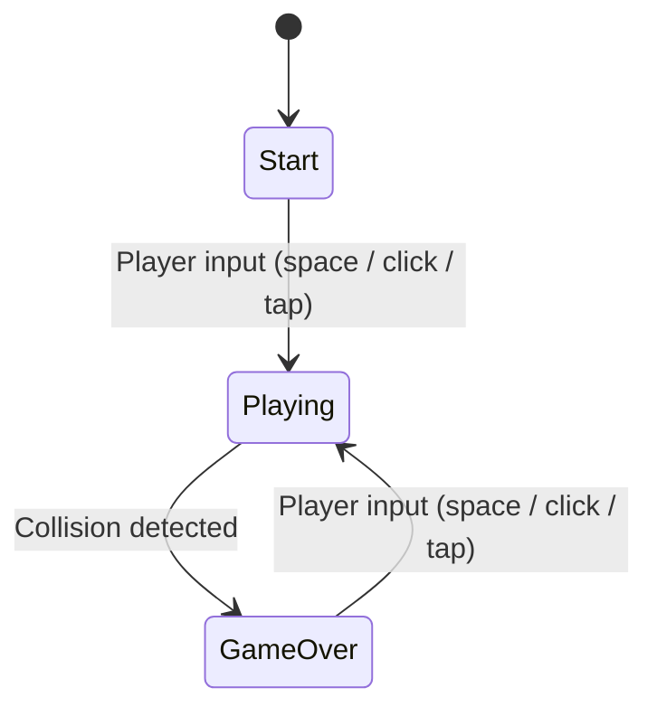
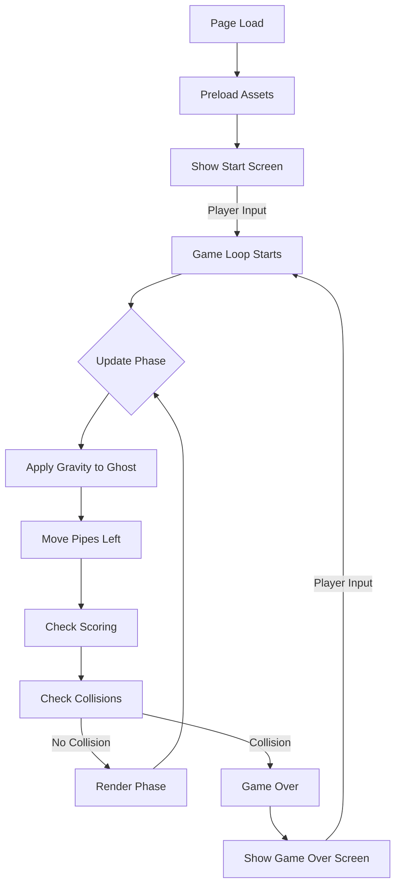

# Design Document: Flappy Kiro

## Overview

Flappy Kiro is a browser-based retro endless side-scroller built entirely with vanilla HTML, CSS, and JavaScript. The game renders on an HTML5 Canvas element and follows the classic Flappy Bird formula: a ghost character (Kiro) falls under gravity, the player taps or presses space to flap upward, and pairs of pipes scroll from right to left. The player scores a point for each pipe pair cleared. Collision with a pipe or the ground ends the game.

The implementation is a single-page application with no build tools or external dependencies. All game logic, rendering, physics, and audio run client-side in a single `requestAnimationFrame` loop.

### Key Design Decisions

- **Single-file vs. multi-file**: The game will be structured as a single `index.html` with an embedded or linked `game.js` and minimal `style.css`. This keeps deployment trivial (open the HTML file) while still separating concerns.
- **requestAnimationFrame with delta-time**: The game loop uses `requestAnimationFrame` for smooth rendering and calculates delta time between frames to keep physics consistent across different refresh rates.
- **Axis-Aligned Bounding Box (AABB) collision**: Simple rectangle overlap checks are sufficient for pipe and boundary collision given the retro art style.
- **HTML5 Audio API**: Sound effects use the `Audio` constructor for simplicity. Preloading happens on page load; playback failures are silently caught to satisfy the graceful-degradation requirement.

## Architecture

The game follows a straightforward game-loop architecture with distinct states managed by a finite state machine.



### High-Level Flow



### Module Responsibilities

| Module       | Responsibility                                                        |
| ------------ | --------------------------------------------------------------------- |
| `index.html` | Canvas element, page structure, script/style references               |
| `style.css`  | Page layout, canvas centering, body background                        |
| `game.js`    | All game logic: loop, state machine, physics, rendering, input, audio |

All game logic lives in `game.js` organized into clearly separated sections (constants, state, entity logic, rendering, input handling, audio, and the main loop).

## Components and Interfaces

### GameState (Enum)

Tracks the current phase of the game.

```
START | PLAYING | GAME_OVER
```

### Ghost

Manages the player character's position, velocity, and rendering.

| Property / Method | Description                                                                                |
| ----------------- | ------------------------------------------------------------------------------------------ |
| `x`, `y`          | Position on canvas (x is fixed, y changes)                                                 |
| `width`, `height` | Dimensions for rendering and hit-box                                                       |
| `velocity`        | Current vertical velocity (positive = downward)                                            |
| `rotation`        | Visual tilt angle derived from velocity                                                    |
| `jump()`          | Sets velocity to a negative (upward) impulse value                                         |
| `update(dt)`      | Applies gravity to velocity, updates y position, clamps to top boundary, computes rotation |
| `draw(ctx)`       | Renders the el-bird.png sprite with rotation and nearest-neighbor scaling                  |
| `reset()`         | Restores initial position and velocity for a new game                                      |
| `getBounds()`     | Returns `{x, y, width, height}` rectangle for collision                                    |

### Pipe

Represents a single pipe pair (top and bottom).

| Property / Method         | Description                                                      |
| ------------------------- | ---------------------------------------------------------------- |
| `x`                       | Horizontal position (starts off-screen right, moves left)        |
| `gapY`                    | Vertical center of the gap                                       |
| `gapHeight`               | Size of the gap (constant across all pipes)                      |
| `width`                   | Horizontal width of each pipe column                             |
| `scored`                  | Boolean flag to prevent double-counting                          |
| `update(dt, speed)`       | Moves pipe left by `speed * dt`                                  |
| `draw(ctx, canvasHeight)` | Renders top pipe, bottom pipe, and cap details                   |
| `getTopBounds()`          | Returns hit-box rectangle for the top pipe                       |
| `getBottomBounds()`       | Returns hit-box rectangle for the bottom pipe                    |
| `isOffScreen()`           | Returns true when the pipe has scrolled fully past the left edge |

### PipeManager

Handles pipe generation, recycling, and the collection of active pipes.

| Property / Method          | Description                                                               |
| -------------------------- | ------------------------------------------------------------------------- |
| `pipes`                    | Array of active Pipe instances                                            |
| `spawnTimer`               | Accumulator tracking time since last spawn                                |
| `spawnInterval`            | Time between pipe spawns                                                  |
| `speed`                    | Horizontal scroll speed (pixels per second)                               |
| `update(dt, canvasHeight)` | Spawns new pipes on interval, updates all pipes, removes off-screen pipes |
| `draw(ctx, canvasHeight)`  | Draws all active pipes                                                    |
| `reset()`                  | Clears all pipes and resets spawn timer                                   |
| `getPipes()`               | Returns the array of active pipes for collision/scoring checks            |

### ScoreManager

Tracks and renders the player's score.

| Property / Method        | Description                                                     |
| ------------------------ | --------------------------------------------------------------- |
| `score`                  | Current integer score                                           |
| `increment()`            | Adds one to the score                                           |
| `reset()`                | Sets score to zero                                              |
| `getScore()`             | Returns current score                                           |
| `draw(ctx, canvasWidth)` | Renders score as large centered text near the top of the canvas |

### AudioManager

Preloads and plays sound effects.

| Property / Method | Description                                                         |
| ----------------- | ------------------------------------------------------------------- |
| `jumpSound`       | Preloaded Audio object for jump.wav                                 |
| `gameOverSound`   | Preloaded Audio object for game_over.wav                            |
| `preload()`       | Creates Audio objects and triggers loading; catches errors silently |
| `playJump()`      | Resets and plays jump sound                                         |
| `playGameOver()`  | Resets and plays game-over sound                                    |

### InputHandler

Listens for keyboard and pointer events and dispatches actions.

| Property / Method | Description                                             |
| ----------------- | ------------------------------------------------------- |
| `onAction`        | Callback invoked on a valid discrete input              |
| `bind(canvas)`    | Attaches keydown (space) and click/touchstart listeners |
| `unbind(canvas)`  | Removes listeners (cleanup)                             |

The `keydown` handler checks for repeat events (`event.repeat`) and ignores them to satisfy the discrete-input requirement.

### Collision Module (functions)

Pure functions for collision logic.

| Function                               | Description                                                    |
| -------------------------------------- | -------------------------------------------------------------- |
| `checkAABBOverlap(a, b)`               | Returns true if two `{x, y, width, height}` rectangles overlap |
| `checkGhostPipeCollision(ghost, pipe)` | Checks ghost bounds against both top and bottom pipe bounds    |
| `checkGroundCollision(ghost, groundY)` | Returns true if ghost bottom edge >= groundY                   |
| `checkCeilingClamp(ghost)`             | Clamps ghost y to 0 if it exceeds the top boundary             |

### Renderer (functions)

Stateless drawing helpers.

| Function                                  | Description                            |
| ----------------------------------------- | -------------------------------------- |
| `drawBackground(ctx, w, h)`               | Fills canvas with sky-blue             |
| `drawGround(ctx, w, h, groundHeight)`     | Draws the earth-toned ground strip     |
| `drawStartScreen(ctx, w, h, ghostSprite)` | Renders start prompt and ghost sprite  |
| `drawGameOverScreen(ctx, w, h, score)`    | Renders final score and restart prompt |

### Game (main controller)

Orchestrates the loop and state transitions.

| Property / Method                                                      | Description                                                      |
| ---------------------------------------------------------------------- | ---------------------------------------------------------------- |
| `state`                                                                | Current GameState                                                |
| `ghost`, `pipeManager`, `scoreManager`, `audioManager`, `inputHandler` | Component instances                                              |
| `canvas`, `ctx`                                                        | Canvas element and 2D rendering context                          |
| `groundY`                                                              | Y-coordinate where the ground begins                             |
| `lastTimestamp`                                                        | Previous frame timestamp for delta-time calculation              |
| `init()`                                                               | Sets up canvas, preloads assets, binds input, shows start screen |
| `handleInput()`                                                        | Routes input action based on current state                       |
| `update(dt)`                                                           | Updates ghost, pipes, checks scoring and collisions              |
| `render()`                                                             | Draws background, ground, pipes, ghost, score, and overlays      |
| `loop(timestamp)`                                                      | Calculates dt, calls update and render, requests next frame      |
| `startGame()`                                                          | Transitions to PLAYING, resets all entities                      |
| `gameOver()`                                                           | Transitions to GAME_OVER, plays sound, stops updates             |

## Data Models

The game is entirely client-side with no persistence layer. All state lives in memory and resets on page reload.

### Constants

```javascript
const CANVAS_WIDTH = 400;
const CANVAS_HEIGHT = 600;
const GRAVITY = 800; // pixels/sec²
const JUMP_VELOCITY = -300; // pixels/sec (negative = upward)
const PIPE_SPEED = 150; // pixels/sec
const PIPE_SPAWN_INTERVAL = 1.8; // seconds
const PIPE_WIDTH = 52;
const GAP_HEIGHT = 130; // pixels
const GROUND_HEIGHT = 80; // pixels
const GHOST_WIDTH = 40;
const GHOST_HEIGHT = 40;
const GHOST_X = 80; // fixed horizontal position
const GHOST_START_Y = 250; // initial vertical position
```

### Runtime State Shape

```
{
  state: GameState,          // START | PLAYING | GAME_OVER
  ghost: {
    x: number,              // fixed at GHOST_X
    y: number,              // current vertical position
    velocity: number,       // current vertical velocity
    rotation: number        // current tilt angle in radians
  },
  pipes: [
    {
      x: number,            // horizontal position
      gapY: number,         // vertical center of gap
      gapHeight: number,    // constant GAP_HEIGHT
      width: number,        // constant PIPE_WIDTH
      scored: boolean       // true once ghost has passed midpoint
    }
  ],
  score: number,             // current score (integer >= 0)
  spawnTimer: number,        // seconds since last pipe spawn
  lastTimestamp: number      // previous frame's timestamp (ms)
}
```

No data is persisted to localStorage or a server. Each game session is ephemeral.

## Correctness Properties

_A property is a characteristic or behavior that should hold true across all valid executions of a system — essentially, a formal statement about what the system should do. Properties serve as the bridge between human-readable specifications and machine-verifiable correctness guarantees._

### Property 1: Gravity updates velocity linearly

_For any_ starting vertical velocity `v` and any positive delta-time `dt`, after one physics update the ghost's new velocity SHALL equal `v + GRAVITY * dt`.

**Validates: Requirements 2.2**

### Property 2: Rotation reflects velocity direction

_For any_ vertical velocity value, the ghost's computed rotation angle SHALL be negative (tilt upward) when velocity is negative, positive (tilt downward) when velocity is positive, and zero when velocity is zero.

**Validates: Requirements 2.5**

### Property 3: Pipes move left at constant speed

_For any_ pipe at horizontal position `x` and any positive delta-time `dt`, after one update the pipe's new position SHALL equal `x - PIPE_SPEED * dt`.

**Validates: Requirements 3.2**

### Property 4: Pipe generation produces valid gaps

_For any_ generated Pipe_Pair, the gap height SHALL equal the constant `GAP_HEIGHT`, AND the top edge of the gap (`gapY - GAP_HEIGHT / 2`) SHALL be greater than or equal to a minimum margin, AND the bottom edge of the gap (`gapY + GAP_HEIGHT / 2`) SHALL be less than or equal to `groundY`.

**Validates: Requirements 3.3, 3.4**

### Property 5: AABB collision detection is correct

_For any_ two axis-aligned bounding boxes A and B (each defined by `{x, y, width, height}` with positive dimensions), `checkAABBOverlap(A, B)` SHALL return true if and only if the rectangles geometrically overlap (i.e., `A.x < B.x + B.width AND A.x + A.width > B.x AND A.y < B.y + B.height AND A.y + A.height > B.y`).

**Validates: Requirements 4.2**

### Property 6: Ceiling clamp constrains ghost position

_For any_ ghost vertical position `y`, after ceiling clamping: if `y < 0` then the resulting position SHALL be `0`; if `y >= 0` then the resulting position SHALL be unchanged.

**Validates: Requirements 4.3**

### Property 7: Ground collision detection is correct

_For any_ ghost with position `y` and height `h`, and any ground boundary `groundY`, `checkGroundCollision` SHALL return true if and only if `y + h >= groundY`.

**Validates: Requirements 4.4**

### Property 8: Scoring increments exactly once per pipe

_For any_ pipe with position `x` and width `w`, and any ghost at horizontal position `ghostX`: the score SHALL increment by exactly 1 when `ghostX` first exceeds `x + w / 2`, and SHALL not increment on any subsequent checks for the same pipe regardless of how many times the check runs.

**Validates: Requirements 5.1, 5.4**

### Property 9: Game reset restores initial state

_For any_ game state (any score value, any ghost position/velocity, any set of pipes), after calling reset, the ghost position SHALL equal `(GHOST_X, GHOST_START_Y)`, the ghost velocity SHALL be `0`, the score SHALL be `0`, and the pipes array SHALL be empty.

**Validates: Requirements 6.5**

### Property 10: Repeat key events are ignored

_For any_ keydown event, the input handler SHALL invoke the action callback if and only if `event.repeat` is `false` and the key is the spacebar. Events with `event.repeat === true` SHALL be silently discarded.

**Validates: Requirements 10.3**

## Error Handling

### Audio Failures

- If `jump.wav` or `game_over.wav` fails to load (network error, missing file, unsupported format), the `AudioManager.preload()` method catches the error and sets the corresponding sound reference to `null`.
- `playJump()` and `playGameOver()` check for `null` before calling `play()` and silently no-op if the sound is unavailable.
- Audio `play()` calls return promises; rejections (e.g., autoplay policy blocks) are caught with `.catch(() => {})` to prevent unhandled promise rejections.

### Sprite Loading

- The ghost sprite (`el-bird.png`) is loaded via `new Image()`. If loading fails, the ghost is rendered as a colored rectangle fallback so the game remains playable.
- An `onerror` handler on the Image object sets a `spriteLoaded` flag to `false`, and the `Ghost.draw()` method checks this flag.

### Frame Timing

- The first call to the game loop receives a timestamp but has no previous timestamp. The initial delta-time is clamped to `0` to prevent a large first-frame jump.
- Delta-time is capped at a maximum (e.g., 0.05 seconds) to prevent physics tunneling if the browser tab is backgrounded and then refocused.

### Input Edge Cases

- `keydown` events with `event.repeat === true` are ignored to prevent continuous jumping from held keys.
- Touch events call `event.preventDefault()` to suppress unwanted scrolling or zooming on mobile.
- Multiple rapid inputs within the same frame are collapsed — only the first triggers an action.

## Testing Strategy

### Testing Framework

- **Unit and property tests**: [fast-check](https://github.com/dubzzz/fast-check) for property-based testing, paired with a standard test runner (Vitest or Jest).
- **No browser required for core logic**: Collision detection, physics, scoring, pipe generation, and input filtering are all pure functions or simple state machines that can be tested in Node.js without a DOM.
- **Canvas rendering tests**: Use example-based tests with a mocked `CanvasRenderingContext2D` to verify draw calls (colors, positions, text content).

### Property-Based Tests

Each correctness property from the design document maps to a single `fast-check` property test with a minimum of 100 iterations.

| Property              | What It Tests                           | Generator Strategy                                                                         |
| --------------------- | --------------------------------------- | ------------------------------------------------------------------------------------------ |
| 1: Gravity velocity   | `ghost.update(dt)` velocity calculation | `fc.float({min: 0.001, max: 0.05})` for dt, `fc.float({min: -500, max: 500})` for velocity |
| 2: Rotation direction | `ghost.rotation` computation            | `fc.float({min: -1000, max: 1000})` for velocity                                           |
| 3: Pipe movement      | `pipe.update(dt)` position calculation  | `fc.float({min: 0, max: 800})` for x, `fc.float({min: 0.001, max: 0.05})` for dt           |
| 4: Pipe gap validity  | Pipe generation gap bounds              | `fc.float({min: 0, max: CANVAS_HEIGHT})` for gapY                                          |
| 5: AABB overlap       | `checkAABBOverlap(a, b)`                | `fc.record({x, y, width, height})` for each box                                            |
| 6: Ceiling clamp      | `checkCeilingClamp(ghost)`              | `fc.float({min: -200, max: 600})` for y                                                    |
| 7: Ground collision   | `checkGroundCollision(ghost, groundY)`  | `fc.float` for y, h, groundY                                                               |
| 8: Scoring once       | Score increment + idempotence           | `fc.float` for ghostX, pipeX, pipeWidth                                                    |
| 9: Game reset         | Full state reset                        | `fc.record` generating arbitrary game states                                               |
| 10: Input filtering   | Repeat event rejection                  | `fc.boolean()` for repeat flag, `fc.string()` for key                                      |

Tag format for each test: `// Feature: flappy-kiro, Property N: <property text>`

### Example-Based Unit Tests

| Area                   | Tests                                                                  |
| ---------------------- | ---------------------------------------------------------------------- |
| Canvas init            | Verify canvas dimensions are 400×600                                   |
| Background             | Verify sky-blue fill color                                             |
| Ground                 | Verify ground drawn at correct y with earth-tone color                 |
| Ghost rendering        | Verify sprite drawn at fixed x, verify `imageSmoothingEnabled = false` |
| Jump                   | Verify velocity set to JUMP_VELOCITY after jump()                      |
| Audio calls            | Mock audio, verify playJump/playGameOver called at correct times       |
| Pipe removal           | Place pipe off-screen left, verify it's removed after update           |
| Pipe caps              | Verify pipe draw includes cap rectangles                               |
| Score display          | Verify score text drawn centered near top                              |
| Start screen           | Verify prompt text and ghost sprite rendered                           |
| Game over screen       | Verify final score and restart prompt rendered                         |
| State transitions      | START → PLAYING → GAME_OVER → PLAYING cycle                            |
| No update in START     | Verify ghost/pipes unchanged when state is START                       |
| No update in GAME_OVER | Verify ghost/pipes unchanged when state is GAME_OVER                   |
| Color palette          | Verify sky-blue, green, earth-tone constants                           |

### Edge Case Tests

| Case                      | What It Covers                                                 |
| ------------------------- | -------------------------------------------------------------- |
| Audio load failure        | Verify game continues when audio files fail to load (Req 8.3)  |
| Sprite load failure       | Verify fallback rectangle rendering when el-bird.png fails     |
| Tab backgrounding         | Verify dt cap prevents physics tunneling after long pause      |
| Ghost at exact boundary   | Ghost y exactly at 0 (ceiling) and exactly at groundY (ground) |
| Pipe at exact screen edge | Pipe x + width exactly at 0                                    |

### Test Configuration

- Property tests: minimum 100 iterations each via `fast-check`
- All core logic tests run in Node.js (no browser dependency)
- Rendering tests use a mock canvas context
- Audio tests use mock Audio objects
